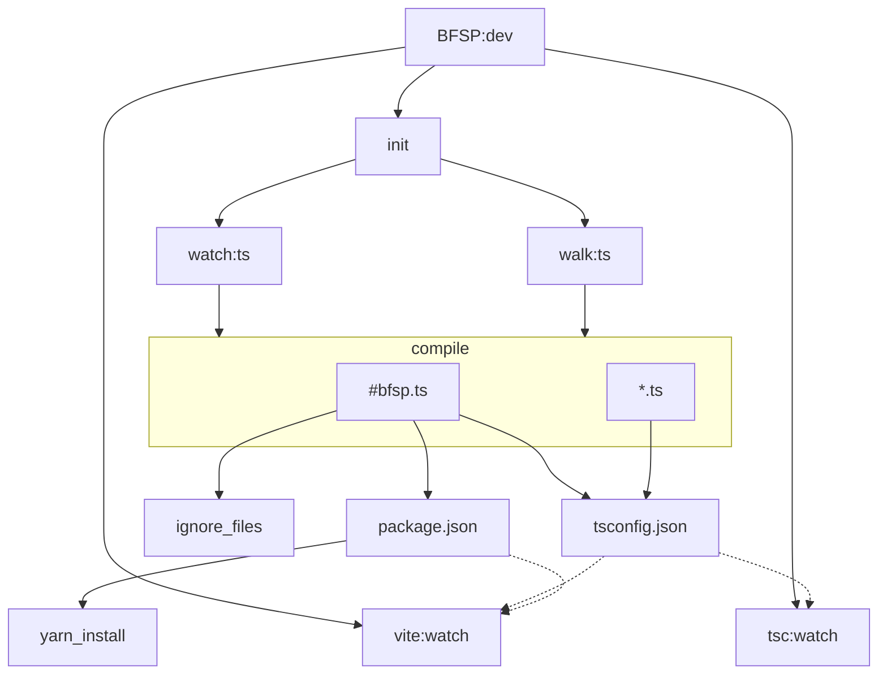
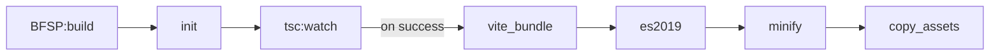
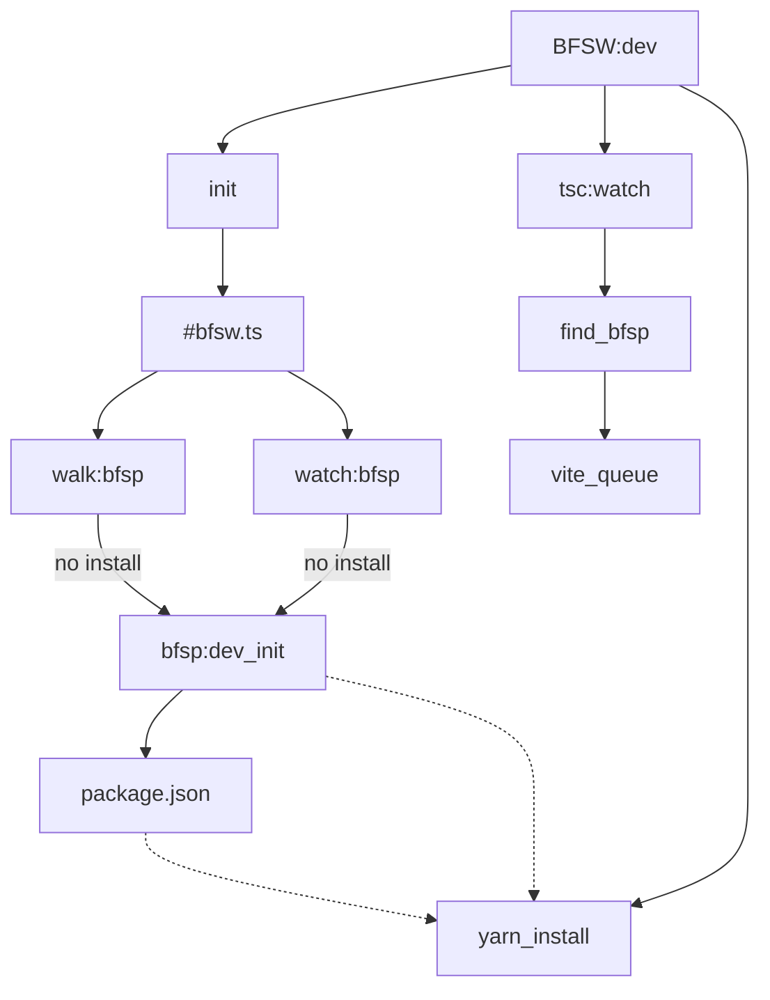
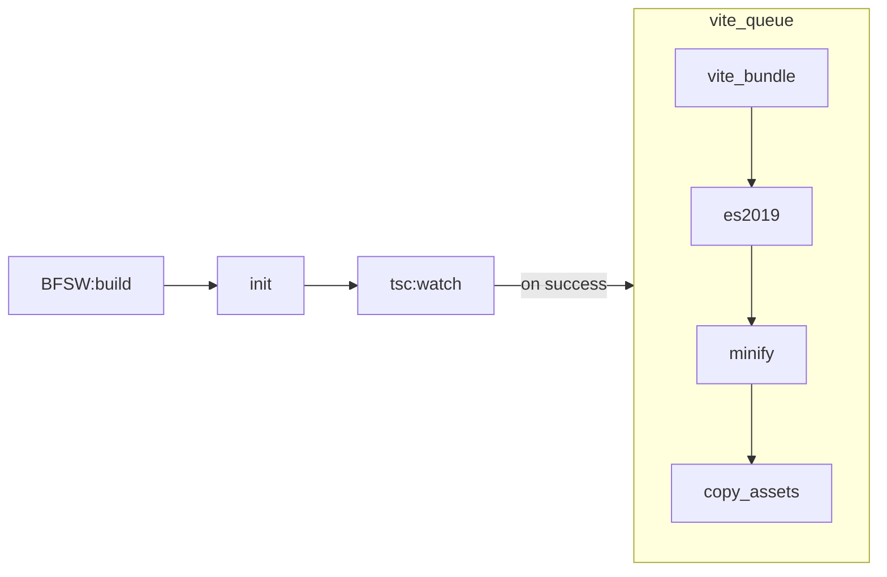
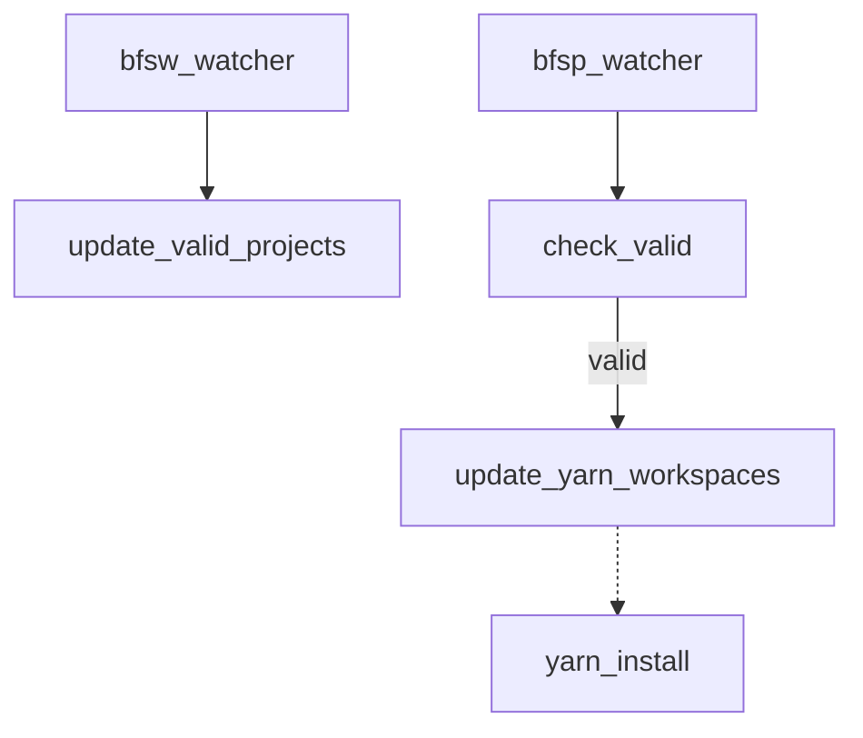

# BFSP

```mermaid
flowchart TD
    BFSP:dev --> init --> watch:ts --> compile
    BFSP:dev --> tsc:watch
    BFSP:dev --> vite:watch
             init --> walk:ts --> compile
             subgraph compile
                #bfsp.ts
                *.ts
             end
        #bfsp.ts --> package.json --> yarn_install
        #bfsp.ts --> ignore_files
        #bfsp.ts --> tsconfig.json
        *.ts --> tsconfig.json

    tsconfig.json -.-> tsc:watch
    tsconfig.json -.-> vite:watch
    package.json -.-> vite:watch
```

```mermaid
flowchart LR
    BFSP:build --> init --> tsc:watch --> |on success| vite_bundle --> es2019 --> minify --> copy_assets
```

# BFSW

```mermaid
flowchart TD
    BFSW:dev --> init --> #bfsw.ts --> walk:bfsp --> |no install| bfsp:dev_init
                          #bfsw.ts --> watch:bfsp --> |no install| bfsp:dev_init
                          bfsp:dev_init --> package.json -.-> yarn_install
    BFSW:dev --> tsc:watch --> find_bfsp --> vite_queue
    BFSW:dev --> yarn_install
    bfsp:dev_init -.-> yarn_install
```

# BFSW

```mermaid
flowchart LR
    BFSW:build --> init --> tsc:watch --> |on success| vite_queue
    subgraph vite_queue
        vite_bundle --> es2019 --> minify --> copy_assets
    end
```

```mermaid
flowchart TD
    bfsw_watcher --> update_valid_projects
    bfsp_watcher --> check_valid --> |valid| update_yarn_workspaces -.->yarn_install
```
